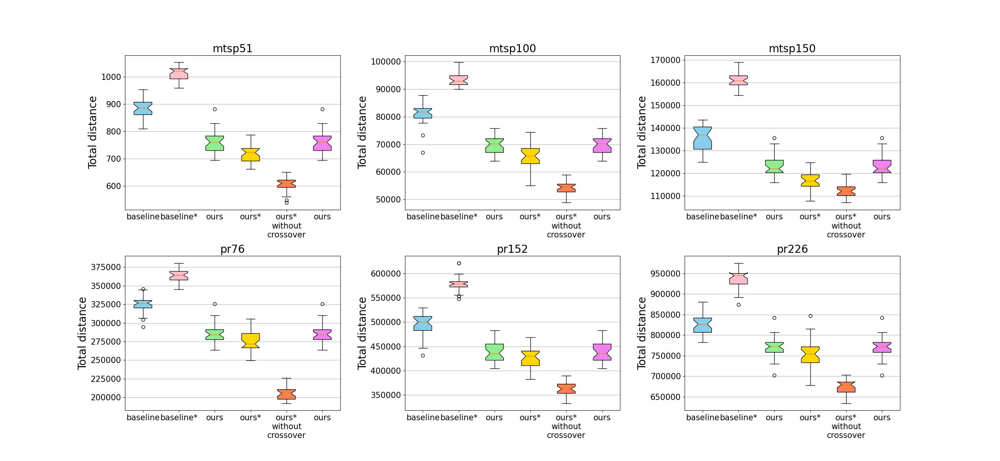

# Prerequisites

This project uses conda environment.

You can download Anaconda from https://www.anaconda.com/products/individual .

# Building

```bash

git clone https://github.com/lingxiaomeng/AAI.git
cd AAI
conda env create -f environment.yml
```

# Run

You can use jupyter run this code.

main.ipynb run baseline and ours for 30 times and save all results to results.txt.

plot.ipynb plot the results.txt file.

You can also run main.py or plot.py directly

# Code Structure

Our algorithm is based on baseline.

Our code is in ./GA_for_mTSP/ours/

# Results



# Dataset

We use instances from https://github.com/picashuo/opgamoea/tree/c65056249bf7bb3334bdfc02ab584c108ccd9048/instances/TSP

- MTSP-51.
- MTSP-100.
- MTSP-150.
- Pr76.
- Pr152.
- Pr226.

# Reference Code

Baseline: https://github.com/Anupal/GA-for-mTSP/tree/master/mtsp

IPGA: https://github.com/alex-cornejo/mTSP-IPGA

